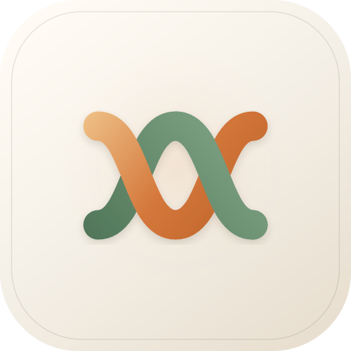

# DesignWeave

<p align="center">
  
</p>

给产品 / 设计 / 测试用的 Cursor。本机工作台：圈文档一块，说一句，AI 改 Markdown。人不用面对终端、源码树、prompt。

墨览是人机共用的纸面，不是产品本身。现行设计从 [`doc/README.md`](doc/README.md) 读起，工程模型见 [`doc/18-工程目录与标准PRD.md`](doc/18-工程目录与标准PRD.md)，托付交互见 [`doc/19-对文档批注托付.md`](doc/19-对文档批注托付.md)。

## 工作台

本机服务器：墨览改标准 PRD 文档包，Claude Agent 读已批准的代码目录。

需要 Node.js 20+、pnpm 8+。Windows 请安装 [Git for Windows](https://git-scm.com/download/win)（自带 Git Bash）；`pnpm dev` 会自动找 bash，不必先开 Git Bash。

```bash
pnpm install
pnpm dev              # Web :3100 · Agent :8787
pnpm stop
```

相关代码在 `apps/web`、`apps/agent` 与 `packages/`。

## 墨览

工作台纸面用的 Markdown 阅读/编辑器。**真源已迁至独立开源仓**：[fengshihao/molan](https://github.com/fengshihao/molan)（官网 / 扩展 / 工作室 / 面向 AI 的贡献说明）。

本仓通过并列目录 `../molan` 的 `file:` 依赖引用 `@molan/host` 与 `@molan/protocol`。开发前请先 clone molan：

```bash
git clone https://github.com/fengshihao/molan.git ../molan
cd ../molan && pnpm install && pnpm build
cd ../DesignWeave && pnpm install && pnpm dev
```

扩展安装、试读、发版都在 molan 仓完成（`./molan help`）。


