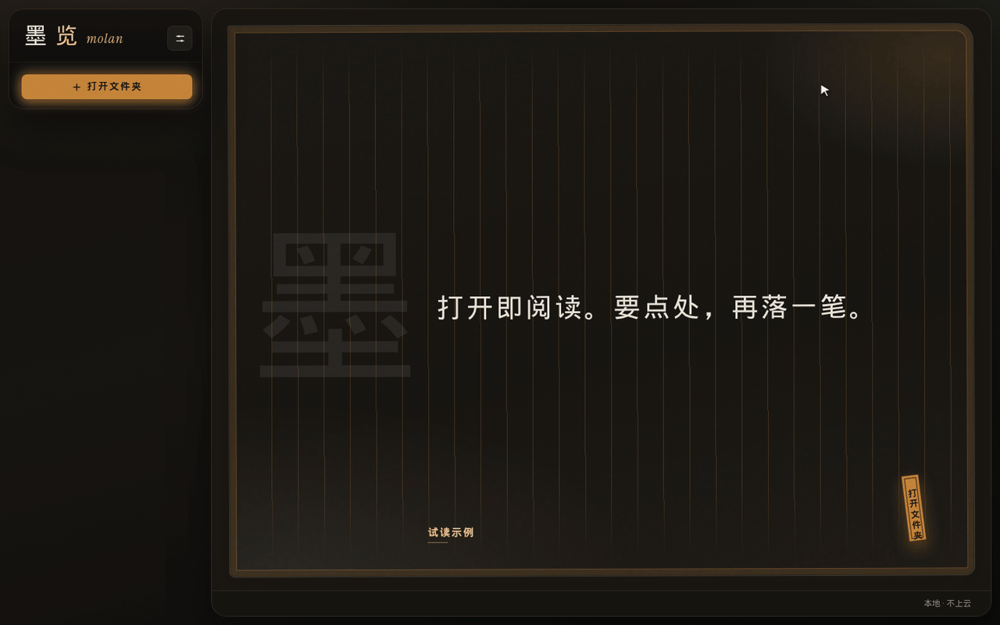

# DesignWeave

当前重点是 **[墨览（Molan）](https://molan.guoyoutech.cn/extension.html)**：一套开源的 Markdown 阅读 / 编辑器。点开即可阅读，需要时再编辑，保存写回原文件。

原先规划的产品设计工作台（PRD 共创、架构 SR、测试方案）会在墨览的编辑能力完善后再跟进，见下方[后续](#后续产品设计工作台)。

## 墨览 Markdown

墨览用 Vditor IR（类 Typora）渲染 Markdown。同一套核心同时用于：

- **Cursor / VS Code 扩展**：安装后点击 `.md` 即用墨览打开
- **浏览器工作室**：本地打开文件夹，Chrome / Edge 可写回原文件

许可证：[MIT](apps/vscode-molan/LICENSE)


### 能力

- 打开默认**预览**，点「编辑」进入即时渲染；未改动关闭不询问保存
- 公式、Mermaid 流程图、表格、任务列表、代码块
- 流程图可放大观看（拖动、滚轮缩放），也可复制源码或图片
- 四种纸面：宣纸、墨夜（默认）、终端、胭脂
- 预览可调字号、行距、段距、字距，选择记在本机
- 文中查找（`Cmd/Ctrl+F`）
- 界面多语言（简体中文、繁體中文、English、日本語、한국어 等）
- 内置裁剪后的 Vditor，打开文件不依赖外网 CDN

### 安装扩展

- Cursor（[Open VSX](https://open-vsx.org/extension/fengshihao/molan-markdown)）：`fengshihao.molan-markdown`
- [VS Code Marketplace](https://marketplace.visualstudio.com/items?itemName=fengshihao.molan-markdown)
- 介绍页：https://molan.guoyoutech.cn/extension.html

源码：[`apps/vscode-molan`](apps/vscode-molan)（用户说明见 [README](apps/vscode-molan/README.md)）。

### 本机运行工作室

需要 Node.js 20+、pnpm 8+。

```bash
pnpm install
pnpm molan            # http://127.0.0.1:5500/
pnpm molan:stop
```

工作室源码在 [`tools/markdown-viewer`](tools/markdown-viewer)。浏览器教程：https://molan.guoyoutech.cn/guide.html



网页版演示（选文件夹、切纸面、调字号、改标题/表格）：[抖音竖屏](tools/markdown-viewer/molan-douyin-9x16.mp4) · [横屏](tools/markdown-viewer/molan-web-demo-16x9.mp4) · [发布文案](tools/markdown-viewer/molan-douyin-发布文案.txt)

### 开发扩展

```bash
pnpm vscode:molan             # 编译
pnpm vscode:molan:package     # 生成 .vsix
pnpm vscode:molan:install     # 打包并安装到本机 Cursor / VS Code
pnpm molan:publish            # 腾讯云 + Open VSX；打开 VS Code 商店管理页
```

仓库根目录按 `F5`（「运行墨览扩展」）。开发说明见 [`apps/vscode-molan/DEV.md`](apps/vscode-molan/DEV.md)。

### 目录

```text
tools/markdown-viewer/   浏览器工作室与编辑器核心（样式、Vditor、写回本地）
apps/vscode-molan/       VS Code / Cursor 扩展（编译时拷入上述核心）
```

## 后续：产品设计工作台

给产品 / 设计用的本机服务器工作台（墨览改文档 + Claude Agent 看代码）。**已拍板的架构与第一刀**见 [`doc/09-云端迭代入口.md`](doc/09-云端迭代入口.md)；从那一篇按序读 `doc/`。

相关代码仍在 `apps/web`、`apps/agent` 与 `packages/`，当前 Web 只是探针，不是 UX 定稿。
