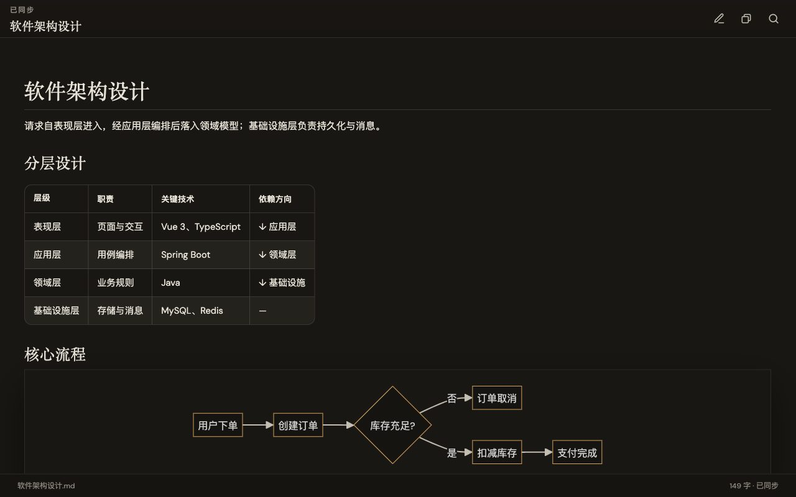

# 墨览 Markdown

用墨览打开 Markdown：默认预览，随时编辑，保存写回原文件。

安装后，点击 `.md` 文件就会进入墨览，不必先面对一屏源码。

## 怎么用

1. 打开任意 Markdown 文件，默认是**预览**。
2. 要改内容时，点顶栏 **编辑**。
3. `Ctrl+S`（Mac 为 `Cmd+S`）保存，直接写回当前文件。
4. 只看不改就关掉即可，不会弹出「是否保存」。

文中的流程图可以点进去放大观看（拖动、滚轮缩放），也可以复制代码或图片。公式和代码块会按阅读样式渲染。

## 和 VS Code 一起用

- 左侧文件树仍是 VS Code 自带的资源管理器。
- 想看原始源码：点编辑器标题栏 **用文本编辑器打开**，或在文件上右键 → Open With → Text Editor。
- 某个文件仍被文本编辑器打开时：命令面板运行 **墨览: 用墨览打开**。
- 希望所有 Markdown 都用墨览：命令面板运行 **墨览: 将墨览设为 Markdown 默认编辑器**。

## 支持的文件

`.md`　`.markdown`　`.mdown`　`.mdx`
