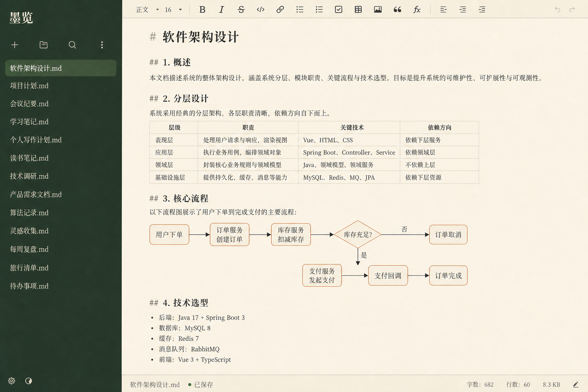

# 墨览 · VS Code / Cursor 扩展

把 `tools/markdown-viewer` 里的墨览所见即所得编辑器，注册成 Markdown 的**自定义编辑器**。安装后点击 `.md` / `.markdown` / `.mdown` / `.mdx` 会直接用墨览打开，`Cmd/Ctrl+S` 写回原文件。



侧栏文件树仍用 VS Code 自带的资源管理器；扩展里只嵌入编辑器、流程图灯箱和墨览样式。

## 本机调试

在仓库根目录：

```bash
pnpm install
pnpm --filter molan-markdown compile
```

然后用 VS Code / Cursor 打开本仓库，按 `F5`（启动配置「运行墨览扩展」），在 Extension Development Host 里点任意 Markdown 文件。

## 安装到本机 VS Code

```bash
pnpm --filter molan-markdown package
```

会在 `apps/vscode-molan/` 生成 `.vsix`，然后：

```bash
code --install-extension apps/vscode-molan/molan-markdown-0.1.0.vsix
# Cursor：
cursor --install-extension apps/vscode-molan/molan-markdown-0.1.0.vsix
```

## 使用

- 点击 Markdown 文件 → 墨览打开（类 Typora 的 IR 模式，可切 WYSIWYG / 分屏）
- `Cmd/Ctrl+S` 保存；VS Code 标题栏的脏点与撤销热退出可用
- 流程图：点击进入观看（拖动 / 滚轮缩放），工具条可编辑源码、复制代码或图片
- 若某次仍打开了文本编辑器：命令面板运行 **「墨览: 用墨览打开」**，或 **「墨览: 将墨览设为 Markdown 默认编辑器」**
- 需要看源码时：编辑器标题栏 **「用文本编辑器打开」**，或右键文件 → Open With → Text Editor

## 实现说明

- 自定义编辑器 viewType：`molan.markdownEditor`，`priority: default`
- 与浏览器工作室共用 `molan.css` + `molan-editor.js`；编译时拷贝进扩展，并内置 Vditor 3.10.9（不依赖外网 CDN）
- 撤销由 Vditor 处理；VS Code 负责脏状态、保存、热退出备份
