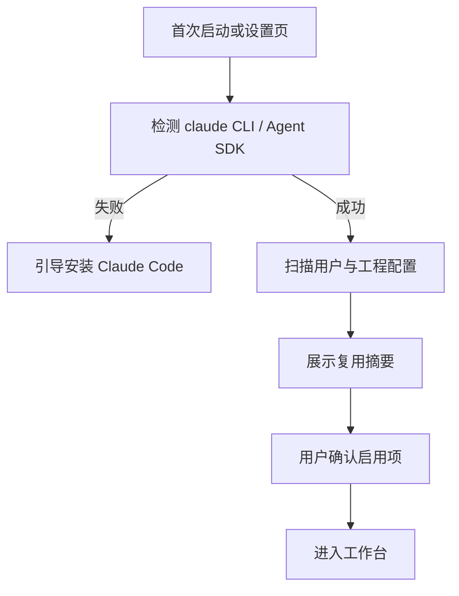

# Claude Code 配置复用与工程绑定

> 状态：讨论中 · 2026-08-09

## 1. 目标

在 **小服务器** 上安装 DesignWeave 后，全员共用该机器上已配好的 Claude Code（skills / MCP / 企业工具），而不是每人重配一套。

注意：同事用浏览器访问时，能力边界 = **服务器上的 Claude**，不是访问者自己电脑里的 Claude。

## 2. 启动时扫描（建议流程）

扫描摘要应展示（只读预览，可勾选启用）：

- 是否发现 `~/.claude/settings.json`
- 语言偏好（如中文）
- 已识别的 MCP / plugins / marketplace（名称列表，不展示密钥）
- Claude 已知本地工程路径（来自 `~/.claude.json` 的 projects 等）
- 当前机器是否具备运行 Agent SDK 的条件

## 3. 创建需求时的工程选择

创建「新需求」向导建议三步：

1. **选工程（服务器路径）**  
   - 不能用「访问者电脑的文件夹选择器」直接选本地盘（浏览器安全限制）  
   - 做法：服务端扫描 / 管理员配置「允许的工程根」+ UI 树形浏览服务器目录  
   - 快捷列表：该服务器 `~/.claude.json` 已知工程、以及曾用过的路径  
2. **写意图**：一句话需求 / 粘贴草稿（中文）  
3. **确认绑定**：工程根、将复用的 `.claude/`、文档落盘（默认 `\<repo\>/.designweave/`）

没有工程的纯概念需求：允许「暂不绑定」，但代码核对类能力禁用。

## 4. Agent 调用策略（相对当前实现的变化）

当前 MVP：`apps/agent` 自管 prompt + 工作区 cwd。

目标态：

- `cwd` = 用户选择的工程根（或子包路径，若用户指定）
- 系统能力继承 Claude Code：skills、MCP、权限模式尽量与用户日常一致
- DesignWeave 额外注入的是 **角色工作流**（设计师共创 / 拷问 / 拆 SR…），而不是替换企业工具链
- 文档写入默认落到 `.designweave/`，避免污染业务源码树；用户可配置

## 5. 安全与合规

- 不把 `ANTHROPIC_AUTH_TOKEN` 等写入 DesignWeave 仓库或导出物  
- 日志脱敏  
- 仅监听 `127.0.0.1`（单用户本机）  
- 可选：启动时要求本机解锁 / 简单口令（非多用户账号体系）

## 6. 与现有代码的差距

| 模块 | 现状 | 目标 |
|------|------|------|
| 创建项目 | 名称 + 想法 | 强制/优先选本地工程目录 |
| Agent cwd | DesignWeave 自有 workspace | 工程根 + `.designweave` 文档区 |
| 配置 | `.env` API Key | 复用 Claude Code settings / 环境 |
| 分发 | Docker Compose | 安装包 / 桌面壳 |
