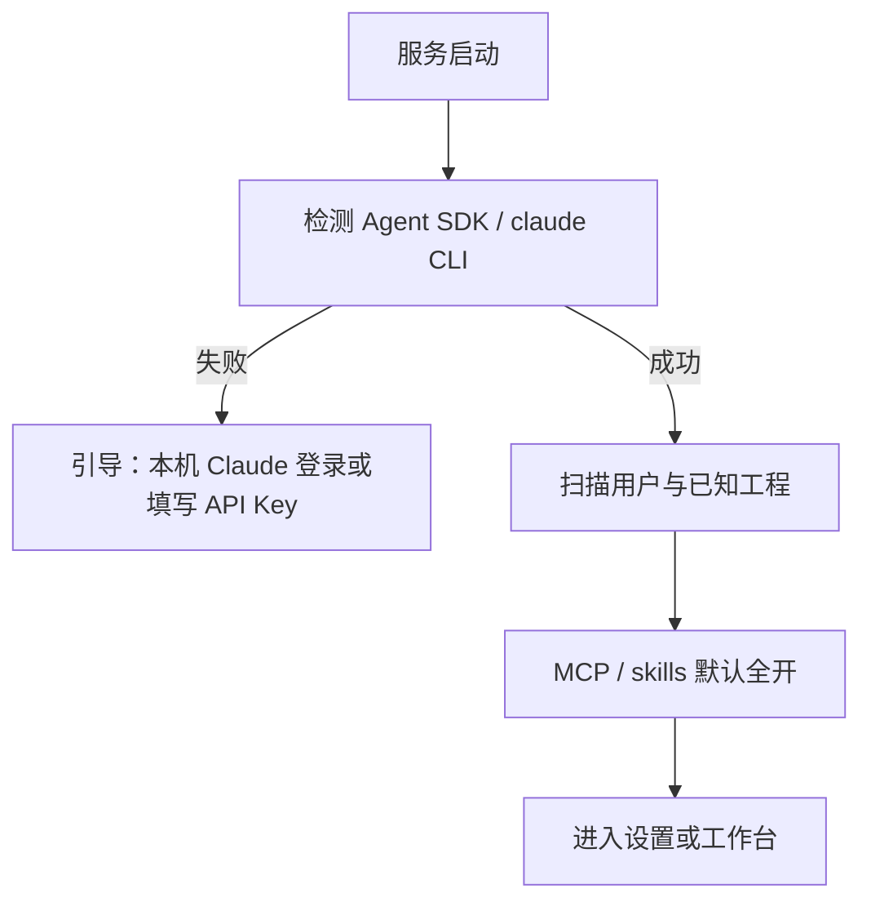

# Claude Code 配置复用与工程绑定

> 状态：已拍板方向 · 2026-08-15  
> 运行形态见 [00-产品重定位.md](./00-产品重定位.md)、[07-客户端架构.md](./07-客户端架构.md)

## 1. 目标

在 **架构师托管后台的那台机器** 上复用已配好的 Claude Code（skills / MCP / 企业工具）。产品设计不自己配 Claude，用的就是这套。

能力边界 = **托管机上的 Claude**。

**B3：** MCP / skills **默认全开**。启动时扫到的一律启用；架构师可在 Web 设置里关掉。没有「首次逐项勾选」向导。

## 2. 启动时扫描（建议流程）

设置页只读展示摘要（架构师可关某项，不挡启动）：

- 是否发现 `~/.claude/settings.json`
- 语言偏好（如中文）
- 已识别的 MCP / plugins / marketplace（名称列表，不展示密钥）
- Claude 已知本地工程路径（来自 `~/.claude.json` 的 projects 等）——用作 **代码根候选**
- 当前机器是否具备运行 Agent SDK 的条件

## 3. 创建工程（仅架构师）

向导：

1. **选文档根（可写）**  
   网页里浏览 **托管机** 目录；或默认 `~/Documents/DesignWeave/<工程名>`。这是墨览与 Agent 写文档的唯一地方。  
2. **选代码根（只读，可多个，可暂不选）**  
   快捷列表来自 `~/.claude.json`；也可在目录树里再选。  
3. **写意图**：一句话需求 / 粘贴草稿（中文）

没有代码根：允许，持续提醒绑定；可行性分析 / 对照代码禁用。

## 4. Agent 调用策略

- `cwd` = **文档根**
- 代码根经 `additionalDirectories` 只读挂入（Read / Glob / Grep）
- 系统能力继承 Claude Code：skills、MCP **默认全开**（架构师可关）
- DesignWeave 额外注入的是 **角色工作流**（设计师共创 / 拷问 / 拆 SR…），而不是替换企业工具链
- 文档只写文档根（见 [04-文档存储原则.md](./04-文档存储原则.md)）
- 长任务挂在 `session_id` 上，见 [07-客户端架构.md](./07-客户端架构.md)

## 5. 安全与合规

- 不把 `ANTHROPIC_AUTH_TOKEN` 等写入文档根或导出物  
- 日志脱敏  
- 后台管理 API 只听本机；工作台开放时鉴权；不对公网  
- 产品设计登录态不能调用管理接口  
- 会话状态可放 SQLite；正文永不进库当唯一副本  
- Agent 默认不能写代码根

## 6. 与现有代码的差距

| 模块 | 现状 | 目标 |
|------|------|------|
| 创建项目 | 名称 + 想法；文档进主仓 `.designweave/` | 先选文档根，再挂 0～N 代码根 |
| Agent cwd | DesignWeave 自有 workspace 或主仓根 | 文档根；代码根只读附加 |
| Session | 一次 HTTP 占线跑完 | `session_id` + 可重放事件流 |
| 配置 | `.env` API Key | 托管机 `~/.claude` 默认全开；仅架构师角色可改 |
| 分发 | Docker / 本机 `pnpm dev` | 安装程序 + 本机服务器；浏览器 + ACL |
