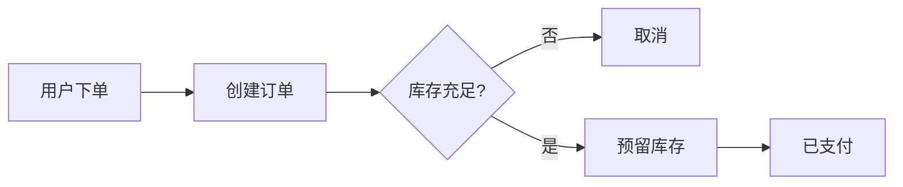

# 软件架构

打开即阅读。要点再点「编辑」。表格、代码、流程图都在纸面上渲染。

```typescript
type Doc = { path: string; text: string };

function open(doc: Doc): string {
  return doc.text.slice(0, 80);
}
```

## 分层

| 层级 | 职责 | 技术栈 |
| --- | --- | --- |
| 展现 | 页面与交互 | Vue 3, TypeScript |
| 应用 | 用例编排 | Spring Boot |
| 领域 | 业务规则 | Java |

## 核心流程


