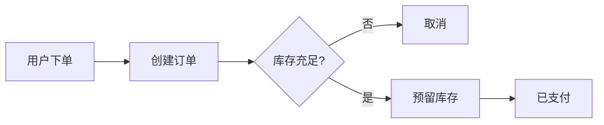

# 软件架构

打开即阅读。要点再点「编辑」。表格、公式、流程图都在纸面上渲染。

## 核心流程

## 分层

| 层级 | 职责 | 技术栈 |
| --- | --- | --- |
| 展现 | 页面与交互 | Vue 3, TypeScript |
| 应用 | 用例编排 | Spring Boot |
| 领域 | 业务规则 | Java |

行内公式 $E = mc^2$。保存时，Chrome / Edge 可写回原文件。
